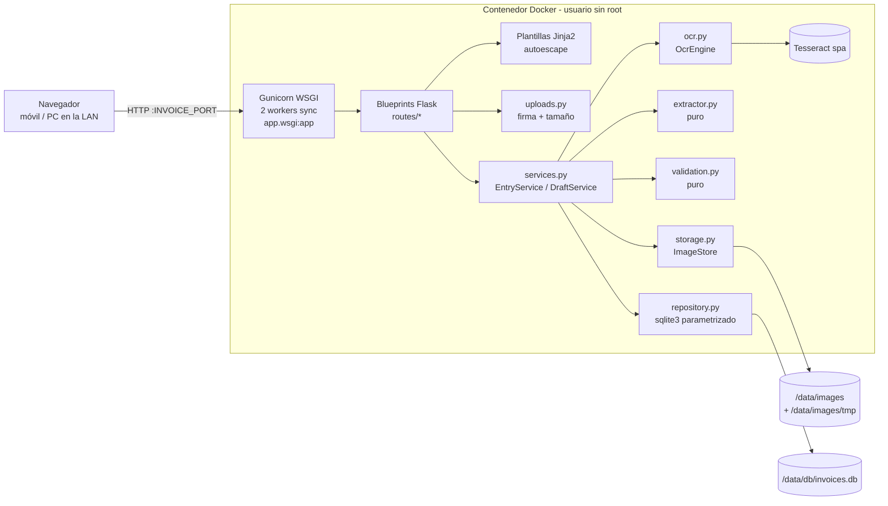

# Documento de Diseño: Invoice Reader

## Visión general

Invoice Reader es una aplicación web monolítica en Python 3.12 construida con Flask 3 (WSGI). La misma aplicación hace tres cosas: sirve las páginas HTML (Jinja2 integrado en Flask + HTMX servido localmente), ejecuta el OCR con Tesseract (`spa`) y extrae los campos con reglas deterministas. Los Apuntes se guardan en SQLite y las Imágenes_Factura en un directorio del disco. Todo se empaqueta en un contenedor Docker pensado para un servidor de la LAN doméstica, donde la Aplicación se sirve con Gunicorn (Servidor_WSGI, *workers* síncronos).

Decisiones principales:

- **WSGI síncrono: Flask + Gunicorn.** El Usuario exige un servidor WSGI en Docker (Req. 10.6). Flask es WSGI nativo y Gunicorn con *workers* `sync` encaja con un código bloqueante (Tesseract, `sqlite3`, ficheros). No hace falta `async`, ni *threadpool*, ni `python-multipart`: Werkzeug (incluido en Flask) ya procesa formularios `multipart/form-data`.
- **Patrón *application factory*.** `create_app(settings, ocr_engine=None) -> Flask` construye la aplicación. Las rutas se agrupan en *Blueprints* (`app/routes/*`), Jinja2 se usa a través de Flask con autoescape y `/static` es la carpeta estática de Flask. `app/wsgi.py` expone `app` para Gunicorn.
- **Monolito con renderizado en servidor.** Un solo usuario y un volumen bajo no justifican una SPA ni una API separada. HTMX se usa solo para mejoras puntuales (filtros del listado sin recargar la página, "Ver siguientes" en la Portada y avisos en línea). Todo funciona también sin JavaScript.
- **Portada en `/`, subida en `/upload`.** `GET /` muestra la Portada (Req. 16): Resumen_Gastos del Año_Actual y del anterior, tabla de Últimas_Facturas paginada de 10 en 10 y botón "Subir factura". El formulario de subida pasa a `GET /upload`; el envío sigue siendo `POST /uploads`.
- **Núcleo puro separado de la E/S.** La detección de formato, la extracción, la validación y el cálculo de filtros y paginación son funciones puras. Ahí se concentran las pruebas basadas en propiedades.
- **Motor_OCR detrás de una interfaz (`OcrEngine`).** En producción se usa `TesseractOcrEngine`; en las pruebas, `FakeOcrEngine`. Así las pruebas no necesitan Tesseract (Req. 15.2).
- **Importes en céntimos enteros.** En SQLite se guardan como `INTEGER` y en Python se manejan como `Decimal` con dos decimales. Así se evitan los errores de redondeo de `float`.
- **Borradores en disco, no en la sesión.** Al subir un fichero se crea un Borrador identificado por un UUID. Su imagen y su Texto_OCR se guardan en `images/tmp/`. El formulario de revisión solo lleva el `draft_id`, de modo que el servidor sigue siendo la fuente de verdad de la imagen y del texto.
- **Sin dependencias de red en ejecución.** HTMX y los estilos se sirven desde `/static`, sin CDN (Req. 2.2).

> Nota sobre ARM: en este entorno no se ha podido consultar el catálogo ARM de HBX Group porque la herramienta de búsqueda no está disponible. Las elecciones tecnológicas (Flask + Gunicorn por decisión del Usuario, SQLite, Tesseract, Docker `python:slim`) vienen fijadas por los requisitos. Antes de implementar, conviene comprobar si hay ARMs activos sobre *Docker Strategy*, *Python/Flask/WSGI* y *Testing* y ajustar lo que haga falta.

> Nota sobre Windows: Gunicorn no funciona en Windows (depende de `fork` y `fcntl`). En el host de desarrollo Windows se usan el servidor de desarrollo de Flask (`python -m app.main`) y el cliente de pruebas de Flask (`app.test_client()`). Gunicorn solo se ejecuta dentro del Contenedor Linux. `pip install -r requirements.txt` sí funciona en Windows porque Gunicorn es Python puro; simplemente no se arranca allí.

## ⚠️ Implicación de seguridad: sin autenticación y expuesta en la LAN

**La Aplicación no tiene autenticación ni autorización.** Escucha en `0.0.0.0` dentro del Contenedor y Docker publica su puerto en todas las interfaces del servidor. Por eso **cualquier dispositivo de la LAN puede ver, subir, modificar y borrar Apuntes y descargar todas las fotos de facturas**, que contienen datos personales y fiscales (NIF, importes, direcciones).

Riesgos concretos:

| Riesgo | Descripción | Mitigación en este diseño | Riesgo residual |
|---|---|---|---|
| Acceso desde la LAN | Cualquier equipo de la red (invitados, IoT comprometido) tiene acceso completo. | Restricción documentada (Req. 14.1–14.2). `docker-compose.yml` permite fijar la IP de escucha publicada (`BIND_ADDRESS`, `0.0.0.0` por defecto) para limitarla a una interfaz concreta. | Alto si la LAN no es de confianza. |
| Exposición a Internet | Redirigir el puerto en el router o usar UPnP expondría todos los datos públicamente. | Aviso explícito en el README y en un comentario de `docker-compose.yml`. No se usa `network_mode: host`. | Depende de la configuración del router. |
| CSRF / DNS rebinding | Una web maliciosa que abra el navegador del Usuario podría enviar un POST a la IP de la LAN (por ejemplo, para borrar apuntes). | Fuera del alcance de los requisitos. Se deja como mejora futura, junto con el inicio de sesión: validar `Origin`/`Host` en peticiones no seguras. | Medio. |
| Tráfico en claro | HTTP sin TLS dentro de la LAN. | Fuera de alcance. Se puede añadir un proxy inverso con TLS. | Bajo o medio según la red. |

Controles que sí aplica el diseño: acceso a imágenes solo mediante nombres UUID validados y resueltos dentro del Almacén_Imágenes (Req. 14.3–14.5), consultas parametrizadas (14.6), autoescape de Jinja2 (14.7), detección del formato por su firma binaria, límite de tamaño (`MAX_CONTENT_LENGTH` de Flask + `validate_upload`), contenedor sin root (10.3), servidor de desarrollo de Flask nunca usado en el Contenedor y cabeceras `X-Content-Type-Options: nosniff` y `Content-Security-Policy: default-src 'self'; img-src 'self'`.

El inicio de sesión simple queda documentado como **mejora futura prevista** (Req. 14.2).

## Arquitectura



### Flujo principal: subir → revisar → guardar

```mermaid
sequenceDiagram
    participant U as Usuario
    participant R as Rutas
    participant D as DraftService
    participant O as OcrEngine
    participant X as Extractor
    participant E as EntryService
    participant IS as ImageStore
    participant DB as Repositorio

    U->>R: POST /uploads (multipart, request.files)
    R->>R: validate_upload(bytes, max)
    R->>D: create_draft(bytes, fmt)
    D->>IS: save_temp(draft_id, bytes, fmt)
    D->>O: extract_text(bytes) [llamada bloqueante en el worker, timeout 60s]
    O-->>D: Texto_OCR | OcrTimeout | OcrUnavailable
    D->>X: extract(texto)
    X-->>D: Borrador
    D->>IS: save_temp_text(draft_id, texto)
    R-->>U: review.html (formulario + imagen + texto)
    U->>R: POST /drafts/{id}/confirm
    R->>E: confirm(draft_id, form)
    E->>E: validate_entry(form)
    alt errores o descuadre sin confirmar
        R-->>U: review.html con errores/avisos y valores conservados
    else válido
        E->>DB: BEGIN; INSERT entry; INSERT OR IGNORE category
        E->>IS: promote(draft_id) → images/{uuid}.{ext} (os.replace)
        E->>DB: COMMIT
        R-->>U: 303 → /entries/{id}?saved=1
    end
```

## Estructura del proyecto

```
factur/
├── app/
│   ├── __init__.py
│   ├── main.py            # create_app(settings, ocr_engine) -> Flask, load_app(), run() (dev server)
│   ├── wsgi.py            # app = load_app() → callable WSGI para Gunicorn (app.wsgi:app)
│   ├── config.py          # Settings desde variables de entorno
│   ├── models.py          # dataclasses: Draft, EntryInput, Entry, EntryFilter, Page, Totals,
│   │                      # YearSummary, MonthlyComparison, ExpenseSummary, RecentPage
│   ├── formatting.py      # format_eur (filtro Jinja "eur"), MONTH_NAMES_ES, parse_recent_page
│   ├── uploads.py         # detect_format, validate_upload
│   ├── ocr.py             # OcrEngine (Protocol), TesseractOcrEngine, excepciones
│   ├── extractor.py       # extract(text) -> Draft y parsers puros
│   ├── tax_id.py          # normalización y validación de NIF/NIE/CIF
│   ├── validation.py      # validate_entry(form) -> ValidationResult
│   ├── storage.py         # ImageStore
│   ├── repository.py      # EntryRepository, CategoryRepository, init_schema
│   ├── services.py        # DraftService, EntryService, DraftPurger, DashboardService
│   ├── health.py          # comprobaciones de salud
│   ├── security.py        # after_request con cabeceras de seguridad
│   ├── routes/            # Blueprints de Flask
│   │   ├── pages.py       # bp "pages": / (Portada), /recent, /upload, /uploads, /drafts/*
│   │   ├── entries.py     # bp "entries": /entries*
│   │   ├── images.py      # bp "images": /entries/<id>/image, /drafts/<draft_id>/image
│   │   └── health.py      # bp "health": /health
│   ├── templates/         # base.html, home.html, _recent_table.html, _recent_rows.html,
│   │                      # upload.html, review.html, list.html, detail.html,
│   │                      # edit.html, confirm_delete.html, error.html, _entries_table.html
│   └── static/            # htmx.min.js (versión fijada, vendorizada), app.css
├── tests/
│   ├── conftest.py        # settings temporales, fixture client (app.test_client())
│   ├── strategies.py      # estrategias Hypothesis (fechas, importes, NIF/CIF, textos)
│   ├── unit/…             # un fichero por módulo
│   └── integration/test_tesseract.py   # @pytest.mark.tesseract (manual)
├── tools/check_coverage.py             # cobertura mínima por fichero (≥80 %)
├── gunicorn.conf.py       # bind 0.0.0.0:INVOICE_PORT, workers, timeout, preload_app
├── Dockerfile
├── docker-compose.yml
├── .dockerignore
├── requirements.txt       # dependencias de ejecución con == fijado
├── requirements-dev.txt   # -r requirements.txt + pruebas, con == fijado
├── pyproject.toml         # configuración de pytest y coverage
└── README.md
```

## Componentes e interfaces

### config.py

```python
@dataclass(frozen=True)
class Settings:
    db_path: Path = Path("/data/db/invoices.db")      # INVOICE_DB_PATH
    images_dir: Path = Path("/data/images")           # INVOICE_IMAGES_DIR
    max_upload_bytes: int = 10 * 1024 * 1024          # INVOICE_MAX_UPLOAD_BYTES
    port: int = 8000                                  # INVOICE_PORT
    host: str = "0.0.0.0"                             # bind de Gunicorn en el contenedor (Req. 10.6, 12.1)
    ocr_timeout_seconds: int = 60
    draft_ttl_hours: int = 24

    @classmethod
    def from_env(cls, env: Mapping[str, str] = os.environ) -> "Settings": ...
```

`from_env` valida que los enteros sean positivos. Si no lo son, lanza `ConfigError` y el proceso termina con un código distinto de cero.

### main.py

```python
def create_app(settings: Settings, ocr_engine: OcrEngine | None = None,
               clock: Callable[[], datetime] = utc_now) -> Flask
def load_app(env: Mapping[str, str] = os.environ) -> Flask     # usado por wsgi.py y run()
def run() -> None                                              # solo desarrollo local
```

`create_app` sigue el patrón *application factory*. Las pruebas inyectan `FakeOcrEngine`, rutas temporales y un reloj fijo. No hay `lifespan`: la lógica de arranque se ejecuta de forma síncrona dentro de `create_app`, antes de devolver la aplicación:

1. `ensure_writable_dir(settings.db_path.parent)` y `ensure_writable_dir(settings.images_dir / "tmp")`. Crean los directorios si no existen (11.6) y prueban a escribir y borrar un fichero. Si fallan, lanzan `StartupError(path)`.
2. `init_schema(db_path)` con `CREATE TABLE IF NOT EXISTS` y las categorías iniciales con `INSERT OR IGNORE`, dentro de `BEGIN IMMEDIATE` (10.5, 7.1). Es idempotente aunque dos procesos lo ejecuten a la vez.
3. Purga inicial: `ImageStore.purge_expired_drafts(clock(), ttl)` (4.6).
4. Guarda en caché el estado del OCR (`ocr_engine.status()`) para `/health`.
5. Configura Flask: `MAX_CONTENT_LENGTH`, `template_folder="templates"`, `static_folder="static"` (`/static`), registra los *Blueprints* de `app/routes/*`, `security.register(app)` (`@app.after_request`), los manejadores `@app.errorhandler` (404, 413, 500) y el filtro Jinja `eur` (`app.add_template_filter(format_eur, "eur")`, Req. 16.18). Los servicios (incluido `DashboardService`, que recibe el mismo `clock`) se guardan en `app.extensions["invoice"]` y las rutas los obtienen con `current_app`.

No se usa `SECRET_KEY` ni la sesión de Flask: el aviso de guardado viaja en la URL (`?saved=1`) y el Borrador se identifica por `draft_id`.

**Purga de Borradores caducados (4.6): purga oportunista, sin hilos.** Además de la purga inicial, `DraftPurger.maybe_purge()` se llama al principio de `GET /` (Portada), `GET /upload` y `POST /uploads`. Solo purga si ha pasado al menos 1 hora desde la última purga de ese proceso (marca con `time.monotonic()`). Se descarta un `threading.Timer`/hilo *daemon* por estos motivos:
- Con Gunicorn, los hilos creados antes del `fork` no existen en los *workers*. Con `preload_app` el hilo quedaría solo en el proceso maestro, y sin él habría un hilo por *worker*. En ambos casos es más frágil que una llamada síncrona.
- Las pruebas no necesitan desactivar nada: no hay trabajo en segundo plano y el reloj se inyecta.
- El coste es un `scandir` de `tmp/` como mucho una vez por hora y *worker*. Si no hay tráfico, los ficheros caducados se borran en la siguiente visita o en el siguiente arranque, lo que es suficiente para un uso doméstico.

Como Gunicorn ejecuta varios *workers*, la purga es **idempotente y tolera borrados concurrentes**: cada `unlink` ignora `FileNotFoundError`, y `stat()` de un fichero que desaparece entre el listado y la comprobación también se ignora. Solo se borran ficheros con más de 24 h, por lo que no compite con un Borrador activo.

`load_app(env)`: construye `Settings.from_env(env)` y llama a `create_app`. Configura el *logging* básico (nivel `INFO`, salida estándar) si no hay manejadores. Ante `ConfigError` o `StartupError` registra `logger.error("No se puede arrancar: %s", exc.path_or_message)` con la ruta afectada y hace `sys.exit(1)` (11.7).

`run()`: `load_app().run(host="127.0.0.1", port=settings.port, debug=False)`. Es el servidor de desarrollo de Flask y **solo** se usa en local (`python -m app.main`), incluido Windows, donde Gunicorn no funciona. Escucha en `127.0.0.1` para no exponer la máquina de desarrollo en la LAN. El Contenedor nunca lo usa.

### wsgi.py

```python
from app.main import load_app

app = load_app()          # callable WSGI: gunicorn app.wsgi:app
```

Al importar el módulo se ejecuta el arranque completo. Si falla, `load_app` registra el error con la ruta y termina con `sys.exit(1)`. Con `preload_app = True` (ver `gunicorn.conf.py`) el módulo se importa una sola vez en el proceso maestro antes del `fork`, así que un directorio no escribible hace que Gunicorn termine con código distinto de cero sin intentar arrancar *workers* (11.7). Las conexiones SQLite son por petición, por lo que no se comparte ninguna conexión entre procesos tras el `fork`.

### uploads.py

```python
class UploadError(Exception):  # base
class MissingFile(UploadError)
class UnsupportedFormat(UploadError)
class FileTooLarge(UploadError)

JPEG_MAGIC = b"\xff\xd8\xff"
PNG_MAGIC  = b"\x89PNG\r\n\x1a\n"

def detect_format(data: bytes) -> Literal["jpg", "png"] | None
def validate_upload(data: bytes | None, max_bytes: int) -> Literal["jpg", "png"]
```

El orden de comprobación es: fichero ausente o vacío → `MissingFile`; tamaño mayor que `max_bytes` → `FileTooLarge`; firma desconocida → `UnsupportedFormat`. Se ignoran el `filename` y el `content_type` del cliente (14.5).

Integración con Flask:
- La ruta obtiene el fichero con `request.files.get("file")` (un `FileStorage` de Werkzeug; no se necesita `python-multipart`) y lee `file.stream.read(max_bytes + 1)`, de modo que nunca carga más de `max_bytes + 1` bytes.
- `app.config["MAX_CONTENT_LENGTH"] = settings.max_upload_bytes + MULTIPART_OVERHEAD` (64 KiB para las cabeceras *multipart* y los campos del formulario). Werkzeug corta antes cualquier petición mayor lanzando `RequestEntityTooLarge`. El manejador `@app.errorhandler(413)` muestra `upload.html` con el mismo mensaje que `FileTooLarge` ("Tamaño máximo: N MB") y código 413. Así, tanto un cuerpo HTTP demasiado grande como un fichero que supera `max_bytes` por menos del margen producen la misma respuesta (1.5).

### ocr.py

```python
class OcrError(Exception)
class OcrTimeout(OcrError)
class OcrUnavailable(OcrError)

class OcrEngine(Protocol):
    def extract_text(self, image_bytes: bytes) -> str: ...
    def status(self) -> OcrStatus: ...          # {"available": bool, "languages": [...]}

class TesseractOcrEngine:
    def __init__(self, lang: str = "spa", timeout_s: int = 60): ...
```

`TesseractOcrEngine.extract_text` abre la imagen con Pillow, aplica `ImageOps.exif_transpose` (solo para el OCR, sin tocar los bytes que se guardan) y llama a `pytesseract.image_to_string(img, lang="spa", timeout=60)`. Traduce las excepciones así: `RuntimeError` con "timeout" → `OcrTimeout`; `TesseractNotFoundError` o `TesseractError` por idioma no disponible → `OcrUnavailable`. `status()` comprueba `"spa" in pytesseract.get_languages()`.

La llamada es una llamada bloqueante normal dentro del *worker* síncrono de Gunicorn: no hay bucle de eventos que proteger. Mientras dura el OCR (hasta 60 s), ese *worker* no atiende otras peticiones; el otro *worker* sigue sirviendo el resto (incluido `/health`). El `timeout` de Gunicorn (90 s) es mayor que `ocr_timeout_seconds` (60 s) para que Gunicorn no mate al *worker* antes de que `pytesseract` devuelva `OcrTimeout`.

### extractor.py (puro y determinista)

```python
FIELDS = ("invoice_date", "supplier", "tax_id", "invoice_number", "concept",
          "category", "entry_type", "base_amount", "vat_amount", "total")

def parse_date(token: str) -> date | None          # dd/mm/aaaa, dd-mm-aaaa, dd.mm.aaaa, dd/mm/aa
def parse_amount(token: str) -> Decimal | None     # "1.234,56", "1234.56", "1234,56 €", "€ 12"
def find_dates(text: str) -> list[date]
def find_tax_ids(text: str) -> list[str]           # normalizados: mayúsculas, sin separadores
def find_labeled_amount(text: str, labels: Sequence[str]) -> Decimal | None
def find_invoice_number(text: str) -> str | None
def find_supplier(text: str) -> str | None
def extract(text: str) -> Draft
```

Reglas:

- **Fechas (3.2).** Regex `\b(\d{1,2})[/.\-](\d{1,2})[/.\-](\d{4}|\d{2})\b`. El separador debe ser el mismo en ambas posiciones. Los años de dos cifras se interpretan como `2000 + aa`. Si la fecha no es válida en el calendario se descarta (`date(...)` lanza `ValueError`). Se elige la primera fecha que aparezca tras una etiqueta "Fecha" y, si no hay ninguna, la primera fecha válida del texto.
- **NIF/NIE/CIF (3.3).** Primero se normaliza cada candidato quitando espacios y guiones y pasándolo a mayúsculas. Después se aplican estos patrones: NIF `^\d{8}[A-Z]$`, NIE `^[XYZ]\d{7}[A-Z]$`, CIF `^[ABCDEFGHJKLMNPQRSUVW]\d{7}[0-9A-J]$`. El texto se recorre con una regex tolerante a separadores: `\b([A-Z]|\d)[\s-]?(\d[\s-]?){7}[\s-]?[A-Z0-9]\b`, sin distinguir mayúsculas. Se propone el primer candidato del emisor (el primero del texto). La validez del dígito de control no se exige al extraer, solo se avisa al validar (5.6).
- **Importes (3.4).** Regex `€?\s*(\d{1,3}(?:\.\d{3})+,\d{2}|\d+,\d{2}|\d+\.\d{2}|\d+)\s*€?`. Si hay coma, los puntos se tratan como separadores de miles y la coma como decimal. Si no hay coma y el número termina en `.dd`, el punto es decimal. El resultado es `Decimal(...).quantize(Decimal("0.01"), ROUND_HALF_UP)`.
- **Base/IVA/Total (3.5).** Se buscan línea a línea con etiquetas sin distinguir mayúsculas ni tildes (tras normalizar con `unicodedata`): base `("base imponible", "base")`; IVA `("cuota iva", "iva", "i.v.a.")` (se descarta el porcentaje `21%` y se toma el importe monetario de la línea); total `("importe total", "total factura", "total a pagar", "total")`. Se prueban de la más específica a la más genérica y se excluyen las líneas de "subtotal" para el total.
- **Número de factura (3.6).** Regex `(?:factura\s*n[º°o.]?|n[º°o.]?\s*(?:de\s*)?factura|n[úu]mero\s+de\s+factura|invoice(?:\s*(?:no|n[º°]|#))?)\s*[:#]?\s*([A-Z0-9][A-Z0-9/\-.]{0,29})`, sin distinguir mayúsculas.
- **Proveedor (3.7).** Es la primera línea tras `strip()` que no esté vacía, que no se lea entera como fecha, NIF/CIF o importe, y que contenga al menos una letra.
- **Concepto y categoría.** No hay regla fiable, así que el extractor los deja vacíos y marcados como no detectados (3.8).
- **Tipo (3.9).** Siempre `gasto`. `entry_type` nunca figura en `missing`.
- **Determinismo (3.10).** No se usan estado global, reloj ni aleatoriedad. Las regex se compilan como constantes del módulo.

### tax_id.py

```python
def normalize(raw: str) -> str
def kind(value: str) -> Literal["NIF", "NIE", "CIF"] | None
def is_valid(value: str) -> bool     # formato + dígito/letra de control
```

- NIF: letra = `"TRWAGMYFPDXBNJZSQVHLCKE"[n % 23]`.
- NIE: se sustituye X/Y/Z por 0/1/2 y se aplica la regla del NIF.
- CIF: se calcula el dígito de control con el algoritmo estándar (suma de pares + suma de dígitos de impares×2). Se admite como control un dígito, una letra `JABCDEFGHI` o ambos según la letra inicial (letras `PQRSNW` → letra; `ABEH` → dígito; resto → cualquiera de los dos).

### validation.py (puro)

```python
@dataclass
class ValidationResult:
    cleaned: EntryInput | None            # None si hay errores
    errors: dict[str, str]                # campo -> mensaje (bloqueante)
    warnings: dict[str, str]              # "tax_id", "totals" (no bloqueante)

def validate_entry(form: Mapping[str, str], *, mismatch_confirmed: bool) -> ValidationResult
```

- Obligatorios: `invoice_date`, `entry_type` y `total` (5.1).
- `invoice_date` con formato ISO `aaaa-mm-dd` (el que envía `<input type="date">`) debe ser una fecha de calendario válida (5.2).
- `entry_type` debe pertenecer a `{"gasto", "ingreso"}` (5.3).
- `base_amount`, `vat_amount` y `total` se leen con `parse_amount`. Si no se pueden leer, o son negativos, van a `errors` (5.4).
- Descuadre (5.5): si la base y el IVA están informados y `|base + iva − total| > 0.01`, se añade `warnings["totals"]`. Si además `mismatch_confirmed` es falso, `cleaned` queda en `None` y se vuelve a mostrar el formulario con la casilla "Confirmo guardar con descuadre".
- NIF/CIF (5.6): si está informado y `not is_valid(normalize(v))`, se añade `warnings["tax_id"]`. Nunca bloquea el guardado.
- Las cadenas se recortan con `strip()` y tienen una longitud máxima (proveedor/concepto 200, categoría 60, número 40). Superarla es un error.

### storage.py

```python
UUID_NAME = re.compile(r"^[0-9a-f]{32}\.(jpg|png)$")
DRAFT_ID  = re.compile(r"^[0-9a-f]{32}$")

class ImageStore:
    def __init__(self, root: Path): ...          # root/ y root/tmp/
    def save_temp(self, draft_id: str, data: bytes, ext: str) -> Path
    def save_temp_text(self, draft_id: str, text: str) -> None
    def load_draft(self, draft_id: str) -> DraftFiles | None
    def promote(self, draft_id: str) -> str       # devuelve nombre final "{uuid4.hex}.{ext}"
    def demote(self, final_name: str, draft_id: str) -> None   # compensación ante fallo
    def discard_draft(self, draft_id: str) -> None
    def delete(self, final_name: str) -> bool     # False si no existía
    def resolve(self, name: str) -> Path | None   # None si nombre inválido o fuera de root
    def purge_expired_drafts(self, now: datetime, ttl: timedelta) -> list[str]
```

- `resolve` exige que el nombre case con `UUID_NAME`, construye `root / name`, aplica `.resolve()` y comprueba `is_relative_to(root.resolve())` y que el fichero exista. Así se protege contra *path traversal* (14.3, 14.4).
- La escritura temporal pasa por `tmp/{draft_id}.{ext}.part`, seguida de `fsync` y `os.replace`. Los bytes no se transforman nunca (6.3).
- `promote` genera un **nuevo** `uuid4().hex` para el nombre definitivo y usa `os.replace` de `tmp/` a `root/`. Es atómico porque ambos están en el mismo sistema de ficheros (el mismo volumen).
- `purge_expired_drafts` borra en `tmp/` los ficheros con `mtime < now − ttl`. `now` se inyecta para poder probarlo. Es idempotente y segura con varios procesos: ignora `FileNotFoundError` tanto en `stat()` como en `unlink()` (otro *worker* pudo borrar el fichero antes) y devuelve solo los nombres que ha borrado ella.

### repository.py

- Usa `sqlite3` de la biblioteca estándar. Abre una conexión por petición (`check_same_thread=False` no es necesario con conexiones cortas), activa `PRAGMA foreign_keys=ON` y `journal_mode=WAL`.
- Varios *workers* de Gunicorn pueden escribir a la vez: la conexión se abre con `timeout=5` (espera por bloqueo) y las escrituras usan `BEGIN IMMEDIATE`, de modo que se serializan en lugar de fallar con `database is locked`.
- **Todas** las consultas usan marcadores `?` (14.6). La cláusula `WHERE` de los filtros se construye con fragmentos fijos y una lista de parámetros. Los valores del usuario nunca se interpolan en el SQL.

```python
class EntryRepository:
    def insert(self, conn, entry: EntryInput, ocr_text: str, image_filename: str, now: datetime) -> int
    def update(self, conn, entry_id: int, entry: EntryInput, now: datetime) -> bool
    def get(self, conn, entry_id: int) -> Entry | None
    def delete(self, conn, entry_id: int) -> Entry | None
    def list(self, conn, flt: EntryFilter, page: int, page_size: int = 20) -> Page[Entry]
    def totals(self, conn, flt: EntryFilter) -> Totals          # suma gastos / ingresos
    # Portada (Req. 16)
    def monthly_expense_totals(self, conn, first_year: int, last_year: int) -> dict[tuple[int, int], int]
    def recent(self, conn, offset: int, limit: int = 10) -> tuple[list[Entry], bool]

class CategoryRepository:
    def list(self, conn) -> list[str]
    def ensure(self, conn, name: str) -> None                   # INSERT OR IGNORE si no hay otra igual con casefold()
```

**Consultas de la Portada (Req. 16).** Las sumas se calculan en SQL sobre los céntimos enteros (`total_cents`), igual que `totals`, y se convierten a `Decimal` en el servicio con el mismo `cents_to_decimal` que el resto del repositorio.

`monthly_expense_totals(conn, first_year, last_year)` devuelve `{(año, mes): céntimos}` solo para los meses que tienen gastos. Los meses sin gastos no aparecen y el servicio los rellena con 0 (16.7):

```sql
SELECT CAST(strftime('%Y', invoice_date) AS INTEGER) AS y,
       CAST(strftime('%m', invoice_date) AS INTEGER) AS m,
       SUM(total_cents)                              AS cents
FROM entries
WHERE entry_type = ?                 -- 'gasto' (16.5)
  AND invoice_date >= ?              -- f"{first_year:04d}-01-01"
  AND invoice_date <  ?              -- f"{last_year + 1:04d}-01-01"
GROUP BY y, m
```

- El filtro por rango de texto ISO (`>=`/`<`) permite usar el índice `ix_entries_type_date`; `strftime` solo se aplica en la agrupación. `invoice_date` siempre es `aaaa-mm-dd` válido (lo garantiza la validación), así que `strftime` nunca devuelve `NULL`.
- Todos los valores van como parámetros `?` (14.6), incluido el literal `'gasto'`.
- El total anual no se consulta aparte: el servicio lo obtiene sumando los 12 meses. Así el total anual y el desglose son coherentes por construcción.

`recent(conn, offset, limit=10)` devuelve `(items, has_more)`:

```sql
SELECT … FROM entries
ORDER BY created_at DESC, id DESC
LIMIT ? OFFSET ?                     -- (limit + 1, offset)
```

Se piden `limit + 1` filas: si llegan más de `limit`, `has_more = True` y se descarta la sobrante. No hace falta un `COUNT(*)`.

**Paginación por *offset* y no por *keyset*.** Se elige *offset* porque:
- Un solo usuario y un volumen doméstico (cientos o pocos miles de Apuntes): el coste de `OFFSET` es despreciable, y más con el índice `ix_entries_created`.
- El número de Página_Recientes cabe en una URL legible y marcable (`/?recent_page=3`) y "Anteriores" (16.13) es trivial (`page − 1`). Con *keyset*, volver atrás exige un segundo cursor invertido.
- Riesgo aceptado: si se da de alta un Apunte entre dos cargas de "Ver siguientes", el bloque siguiente se desplaza una fila y un Apunte puede aparecer repetido en la vista acumulada con HTMX. Con un solo usuario, que es quien da de alta, es improbable y no pierde datos; recargar la Portada lo corrige.

**Orden de `created_at`.** Para que el orden de texto coincida con el cronológico, `insert` guarda siempre `created_at` en UTC con formato fijo `now.astimezone(timezone.utc).isoformat(timespec="microseconds")` (por ejemplo `2025-03-01T10:15:00.123456+00:00`). El `id` desempata Apuntes con la misma Fecha_Alta.

### services.py

`DraftService.create(data, fmt) -> DraftView`:
1. `draft_id = uuid4().hex`; `store.save_temp(...)`.
2. `text = ocr.extract_text(data)` como llamada bloqueante. Si lanza `OcrTimeout` o `OcrUnavailable`, se registra con `logger.error` y el resultado es un Borrador vacío con `notice="ocr_failed"` (2.3, 2.4). Si `text.strip() == ""`, el resultado es un Borrador vacío con `notice="no_text"` (2.5). En otro caso se llama a `extractor.extract(text)`.
3. `store.save_temp_text(draft_id, text)`.

`EntryService.confirm(draft_id, form, mismatch_confirmed) -> ConfirmResult`:
1. `load_draft`. Si no existe o ha caducado → 404.
2. `validate_entry`. Si `cleaned is None`, devuelve los errores y avisos junto con el formulario original (5.7).
3. Transacción atómica (6.5):
   ```python
   conn.execute("BEGIN IMMEDIATE")
   try:
       categories.ensure(conn, cleaned.category)            # si informada (7.3)
       final = store.promote(draft_id)                      # fallo → rollback BD
       entry_id = entries.insert(conn, cleaned, text, final, now)
       conn.commit()                                        # fallo → demote + rollback
   except Exception:
       conn.rollback()
       if final: store.demote(final, draft_id)
       logger.exception("Error guardando apunte")
       raise SaveError
   store.discard_draft_text(draft_id)
   ```
   El Borrador sigue disponible tras un fallo, así que el Usuario puede reintentar. La restricción `image_filename NOT NULL UNIQUE` garantiza una imagen por Apunte (6.4).

`EntryService.update(entry_id, form, mismatch_confirmed)` aplica la misma validación (9.1).

`DraftPurger(store, ttl, interval=timedelta(hours=1), clock, monotonic=time.monotonic)`:
- `purge_now() -> list[str]`: llama a `store.purge_expired_drafts(clock(), ttl)` y actualiza la marca de la última purga.
- `maybe_purge() -> list[str]`: llama a `purge_now()` solo si han pasado al menos `interval` desde la última purga de este proceso; si no, devuelve `[]`. Un fallo inesperado se registra con `logger.exception` y no interrumpe la petición.

`EntryService.delete(entry_id)`: borra la fila dentro de una transacción. Tras el `commit` llama a `store.delete(name)`. Si devuelve `False`, emite `logger.warning` y la eliminación se completa igualmente (9.3, 9.4). Si falla el borrado del fichero después del `commit`, queda un fichero huérfano que se registra en el log (no hay Apunte sin imagen visible para el Usuario). Se acepta así porque la operación inversa, restaurar la fila, es más arriesgada.

`DashboardService(entries: EntryRepository, connect: Callable[[], Connection], clock: Callable[[], datetime])` (Req. 16):

```python
RECENT_PAGE_SIZE = 10

class DashboardService:
    def expense_summary(self) -> ExpenseSummary
    def recent(self, page: int) -> RecentPage       # page ya normalizada (≥ 1)
```

- `expense_summary()`: `current = clock().year`, `previous = current − 1` (16.2). Llama una sola vez a `monthly_expense_totals(conn, previous, current)` y construye exactamente 12 `MonthlyComparison` (meses 1..12, en orden) con `cents.get((año, mes), 0)` convertidos a `Decimal` (16.6, 16.7). Los totales anuales son la suma entera de los 12 meses de cada año, convertida después a `Decimal` (16.3, 16.4). Sin Apuntes, todo vale `Decimal("0.00")` (16.17).
- **Año_Actual completo.** Se suman todos los gastos con `invoice_date` en el año natural del Reloj, del 1 de enero al 31 de diciembre. En la práctica equivale a "del 1 de enero a hoy", pero si el Usuario registra una factura con fecha futura dentro del mismo año también cuenta, tal como pide el requisito ("todos los gastos con fecha de factura en el Año_Actual").
- **Zona horaria.** El Reloj inyectado (`utc_now`) devuelve UTC, y el año se toma de ese instante. Entre las 00:00 y la 01:00/02:00 (hora peninsular) del 1 de enero la Portada sigue mostrando el año anterior como Año_Actual. Se acepta para un uso doméstico; si molesta, basta con inyectar un reloj en hora local.
- `recent(page)`: `offset = (page − 1) × 10`; llama a `entries.recent(conn, offset, 10)` y devuelve `RecentPage(items, page, 10, has_more)` (16.8, 16.10, 16.14).

### formatting.py (puro)

```python
MONTH_NAMES_ES = ("Enero", "Febrero", "Marzo", "Abril", "Mayo", "Junio", "Julio",
                  "Agosto", "Septiembre", "Octubre", "Noviembre", "Diciembre")
MAX_RECENT_PAGE = 100_000

def format_eur(value: Decimal | None) -> str        # Decimal("1234.5") -> "1.234,50 €"; None -> ""
def parse_recent_page(raw: str | None) -> int       # "3" -> 3; None, "", "abc", "0", "-1", "1e3", "100001" -> 1
```

- `format_eur` cuantiza a dos decimales con `ROUND_HALF_UP`, agrupa los miles con `.` y usa `,` como separador decimal, seguido de `" €"` (16.18). Usa un espacio normal para que `parse_amount` lo lea (propiedad 24). No depende de `locale` (el contenedor no tiene *locales* instalados y el resultado debe ser determinista). Los importes negativos no existen (5.4), pero la función los admite con el signo delante por robustez.
- Se registra como filtro Jinja `eur` en `create_app`. La Portada lo usa en todos los importes; el resto de plantillas puede usarlo sin cambios de requisitos.
- `parse_recent_page` solo acepta cadenas de dígitos ASCII (`str.isdecimal()` con ASCII) con valor entre 1 y `MAX_RECENT_PAGE`; cualquier otra cosa devuelve 1 (16.15). Se elige "tratar como la página 1" y no un 400 porque el parámetro solo lo generan los enlaces de la propia Portada: un valor manipulado o antiguo no merece una página de error y así la Portada siempre carga. El tope evita *offsets* absurdos.

### security.py

```python
SECURITY_HEADERS = {
    "X-Content-Type-Options": "nosniff",
    "Content-Security-Policy": "default-src 'self'; img-src 'self'",
}

def register(app: Flask) -> None     # registra un @app.after_request que añade SECURITY_HEADERS
```

El *hook* `after_request` añade las cabeceras a todas las respuestas, incluidas las de error y los ficheros estáticos, sin sobrescribir una cabecera que la ruta ya haya fijado.

### Rutas HTTP

| Método | Ruta | Respuesta | Req. |
|---|---|---|---|
| GET | `/?recent_page=` | Portada `home.html`: Resumen_Gastos, Página_Recientes `recent_page` (1 por defecto o si es inválida), botón "Subir factura" | 16.1–16.19 |
| GET | `/recent?page=` | Con `HX-Request`: fragmento `_recent_rows.html` (filas + botón "Ver siguientes" *out-of-band*) · sin `HX-Request`: 303 → `/?recent_page=N` | 16.10–16.15 |
| GET | `/upload` | Formulario de subida (`accept="image/jpeg,image/png"`, `capture="environment"`) | 1.1, 12.4 |
| POST | `/uploads` | 200 `review.html` · 400 `upload.html` con error (sin fichero / formato) · 413 (tamaño) | 1.2–1.6, 2.x, 4.1–4.3 |
| GET | `/drafts/{draft_id}/image` | Imagen temporal · 404 | 4.2 |
| POST | `/drafts/{draft_id}/confirm` | 303 → `/entries/{id}?saved=1` · 422 `review.html` con errores · 500 `review.html` con error de guardado | 4.4, 5.x, 6.x |
| POST | `/drafts/{draft_id}/cancel` | Descarta el Borrador, 303 → `/upload` | 4.5 |
| GET | `/entries?type=&category=&date_from=&date_to=&page=` | Listado (parcial `_entries_table.html` si `HX-Request`) | 8.1–8.4 |
| GET | `/entries/{id}` | Detalle · 404 | 6.6, 8.5, 8.6 |
| GET/POST | `/entries/{id}/edit` | Edición y validación · 404 | 9.1 |
| GET | `/entries/{id}/delete` | Página de confirmación | 9.2 |
| POST | `/entries/{id}/delete` | 303 → `/entries` | 9.3, 9.4 |
| GET | `/entries/{id}/image` | Imagen (`Content-Type` según la extensión, `nosniff`) · 404 | 8.5, 14.3 |
| GET | `/health` | JSON 200/503 | 13.x |

Las rutas se definen en *Blueprints* de Flask. En la tabla, `{id}` corresponde al conversor `<int:entry_id>` y `{draft_id}` a `<draft_id>` (cadena), que se valida contra `DRAFT_ID`. Cualquier otro valor responde 404 con `error.html` (con `<int:…>`, Werkzeug ya devuelve 404 si no es un entero). Manejadores globales registrados con `@app.errorhandler`:
- `404` → `error.html` con código 404.
- `413` (`RequestEntityTooLarge`) → `upload.html` con el mensaje de tamaño máximo y código 413.
- `500` (`InternalServerError`, que en Flask envuelve cualquier excepción no controlada en `e.original_exception`) → `logger.exception` y `error.html` genérico con código 500, sin traza.

`GET /`, `GET /upload` y `POST /uploads` llaman a `DraftPurger.maybe_purge()` antes de su lógica.

Tras cancelar un Borrador se redirige a `/upload` y no a la Portada: quien cancela suele querer repetir la foto. El formulario de subida (`upload.html`) sigue enviando a `POST /uploads`, y los errores 400/413 vuelven a renderizar `upload.html` como hasta ahora.

**Portada y "Ver siguientes" (16.10–16.14).** Un único control sirve con y sin JavaScript:

```html
<!-- dentro de _recent_table.html; id estable para el reemplazo out-of-band -->
<div id="recent-more">
  
  <a class="button" href="/?recent_page={{ recent.page + 1 }}"
     hx-get="/recent?page={{ recent.page + 1 }}"
     hx-target="#recent-rows" hx-swap="beforeend">Ver siguientes</a>
  
  <a href="/?recent_page={{ recent.page - 1 }}">Anteriores</a>
</div>
```

- Con JavaScript, HTMX pide `/recent?page=N+1` y añade las filas devueltas al final de `<tbody id="recent-rows">` (vista acumulada, 16.11). El fragmento incluye además `<div id="recent-more" hx-swap-oob="outerHTML">` con el botón de la página siguiente, o vacío si `has_more` es falso (16.14). En la vista acumulada no se muestra "Anteriores", porque las filas anteriores siguen en pantalla.
- Sin JavaScript, el `href` carga la Portada completa con la Página_Recientes N+1 (16.12) y "Anteriores" vuelve a N−1 (16.13).
- `GET /recent` sin `HX-Request` (por ejemplo, abierto en otra pestaña) redirige con 303 a `/?recent_page=N`, de modo que nunca se muestra un fragmento suelto.
- `recent_page`/`page` se normalizan con `parse_recent_page` (16.15). Si la página pedida no tiene Apuntes y es mayor que 1, `home.html` muestra "No hay más facturas" y un enlace a la página 1 (16.16).
- Si no hay ningún Apunte, la Portada muestra "Todavía no hay facturas. Sube la primera." con enlace a `/upload`, y el Resumen_Gastos con todos los importes a `0,00 €` (16.17).

Sobre las guías de API: es una aplicación HTML y no una API REST pública, así que no se añade el prefijo `/v1`. Si en el futuro se expone una API JSON, irá bajo `/api/v1/…` con paginación `page`, `pageSize` y `total`. El listado HTML ya muestra esos tres datos (8.2).

### Endpoint_Salud

```json
{"status": "ok|degraded|error",
 "database": {"ok": true},
 "images": {"ok": true, "writable": true},
 "ocr": {"ok": true, "languages": ["spa", "eng"]}}
```

- Base_Datos: `SELECT 1` con `sqlite3.connect(timeout=1)`.
- Almacén: se crea y se borra `tmp/.health-{uuid}`.
- OCR: se usa el estado cacheado en el arranque. No se invoca Tesseract en cada petición, para garantizar una respuesta en menos de 2 s (13.1).
- Código: 200 si la BD y el almacén están bien (con OCR caído, `status="degraded"` y 200); 503 en otro caso (13.2, 13.3).

### Interfaz_Web

- `base.html`: incluye `<meta name="viewport" content="width=device-width, initial-scale=1">`, una hoja de estilo propia con diseño de una columna por debajo de 640 px y dos columnas (imagen | formulario) en escritorio, y `htmx.min.js` local servido desde la carpeta estática de Flask (`url_for('static', filename=...)`). Flask activa el autoescape de Jinja2 para las plantillas `.html` (14.7) y no se usa el filtro `|safe` con datos del Usuario ni del OCR. El Texto_OCR se muestra dentro de `<pre>` escapado.
- Navegación común en `base.html`: "Inicio" (`/`), "Subir factura" (`/upload`) y "Apuntes" (`/entries`), como `<nav aria-label="Principal">` (1.1).
- `home.html` (Portada, 16.x): botón destacado "Subir factura" (`/upload`); Resumen_Gastos con dos tarjetas de total anual ("Gastos {año anterior}" y "Gastos {Año_Actual}") y una tabla `<table>` con `<caption>`, cabeceras `<th scope="col">` Mes / {año anterior} / {Año_Actual} y 12 filas `<th scope="row">` con `MONTH_NAMES_ES`; todos los importes con `|eur` y alineados a la derecha; después incluye `_recent_table.html`.
- `_recent_table.html`: tabla de Últimas_Facturas (fecha de factura, proveedor, concepto, categoría, Tipo, total `|eur`, enlace "Ver" a `/entries/{id}` con `aria-label` que incluye el proveedor), `<tbody id="recent-rows">` que incluye `_recent_rows.html`, el bloque `#recent-more` y los mensajes de vacío (16.16, 16.17). `_recent_rows.html` contiene solo las `<tr>` y, cuando se sirve por `/recent`, el `#recent-more` *out-of-band*.
- Portada en móvil (16.19): las tablas van dentro de `<div class="table-scroll">` (`overflow-x: auto`) para que a 360 px no se desborde la página; en la tabla de Últimas_Facturas, por debajo de 640 px, cada fila se muestra como tarjeta apilada con etiquetas (`data-label` + CSS), sin ocultar ninguna columna exigida por 16.9. El botón "Ver siguientes" ocupa todo el ancho en móvil (objetivo táctil ≥ 44 px).
- `review.html`: muestra la imagen, el Texto_OCR y el formulario. Los campos de `draft.missing` llevan la clase `field--missing` y el texto "No detectado" asociado con `aria-describedby` (4.3). Hay avisos `ocr_failed` y `no_text`. La categoría usa `<input list="categories">` con un `<datalist>` (7.2). Los errores de campo van con `aria-invalid="true"`.
- `list.html`: formulario de filtros con `hx-get="/entries" hx-target="#entries" hx-push-url="true"`, una tabla con paginación ("Página X de Y · 20 por página · N apuntes") y, si hay filtros, las sumas de gastos e ingresos (8.4).
- Accesibilidad: todos los campos tienen `<label>`, el foco es visible, los errores se anuncian en una región `role="alert"` y el contraste es AA. La validación WCAG completa necesita pruebas manuales con tecnologías de apoyo.

## Modelo de datos

```sql
CREATE TABLE IF NOT EXISTS entries (
    id               INTEGER PRIMARY KEY AUTOINCREMENT,
    invoice_date     TEXT    NOT NULL,                    -- ISO aaaa-mm-dd
    supplier         TEXT,
    tax_id           TEXT,
    invoice_number   TEXT,
    concept          TEXT,
    category         TEXT,
    entry_type       TEXT    NOT NULL CHECK (entry_type IN ('gasto','ingreso')),
    base_cents       INTEGER CHECK (base_cents  IS NULL OR base_cents  >= 0),
    vat_cents        INTEGER CHECK (vat_cents   IS NULL OR vat_cents   >= 0),
    total_cents      INTEGER NOT NULL CHECK (total_cents >= 0),
    ocr_text         TEXT    NOT NULL DEFAULT '',
    image_filename   TEXT    NOT NULL UNIQUE,
    created_at       TEXT    NOT NULL,                    -- ISO 8601 UTC
    updated_at       TEXT
);
CREATE INDEX IF NOT EXISTS ix_entries_date ON entries(invoice_date DESC, id DESC);
-- Portada (Req. 16)
CREATE INDEX IF NOT EXISTS ix_entries_created   ON entries(created_at DESC, id DESC);   -- Últimas_Facturas
CREATE INDEX IF NOT EXISTS ix_entries_type_date ON entries(entry_type, invoice_date);   -- Resumen_Gastos

CREATE TABLE IF NOT EXISTS categories (
    name TEXT PRIMARY KEY COLLATE NOCASE
);
-- Semilla (INSERT OR IGNORE): Suministros, Alimentación, Transporte, Hogar, Salud,
-- Ocio, Servicios profesionales, Impuestos, Otros
```

`NOCASE` solo pliega ASCII, así que `CategoryRepository.ensure` compara además con `str.casefold()` en Python ('Ñ'/'ñ', 'Ó'/'ó', 'ß'/'SS') antes de insertar.

Modelos en Python (`models.py`):

```python
EntryType = Literal["gasto", "ingreso"]

@dataclass(frozen=True)
class Draft:
    values: dict[str, str]          # valores de formulario (fecha ISO, importes "1234.56")
    missing: frozenset[str]         # campos no detectados
    notice: Literal["ocr_failed", "no_text"] | None = None

@dataclass(frozen=True)
class EntryInput:
    invoice_date: date
    entry_type: EntryType
    total: Decimal
    base_amount: Decimal | None = None
    vat_amount: Decimal | None = None
    supplier: str | None = None
    tax_id: str | None = None
    invoice_number: str | None = None
    concept: str | None = None
    category: str | None = None

@dataclass(frozen=True)
class Entry(EntryInput):
    id: int; ocr_text: str; image_filename: str; created_at: datetime; updated_at: datetime | None

@dataclass(frozen=True)
class EntryFilter:
    entry_type: EntryType | None = None
    category: str | None = None
    date_from: date | None = None
    date_to: date | None = None          # inclusivo

@dataclass(frozen=True)
class Page(Generic[T]):
    items: list[T]; page: int; page_size: int; total: int

# Portada (Req. 16)
@dataclass(frozen=True)
class YearSummary:
    year: int
    total: Decimal                       # suma de gastos del año, 2 decimales

@dataclass(frozen=True)
class MonthlyComparison:
    month: int                           # 1..12
    name: str                            # MONTH_NAMES_ES[month - 1]
    previous: Decimal                    # gastos del mes en el año anterior (0.00 si no hay)
    current: Decimal                     # gastos del mes en el Año_Actual (0.00 si no hay)

@dataclass(frozen=True)
class ExpenseSummary:
    previous: YearSummary
    current: YearSummary
    months: tuple[MonthlyComparison, ...]   # exactamente 12, meses 1..12 en orden

@dataclass(frozen=True)
class RecentPage:
    items: list[Entry]                   # como mucho page_size
    page: int                            # ≥ 1
    page_size: int                       # 10
    has_more: bool                       # hay Apuntes después del último de items
```

`RecentPage` no reutiliza `Page` porque no lleva `total`: calcularlo exigiría un `COUNT(*)` que la Portada no necesita, y `has_more` sale de pedir `limit + 1` filas.

Almacenamiento en disco:

```
/data/db/invoices.db
/data/images/{uuid32}.jpg|png            # imágenes de Apuntes
/data/images/tmp/{draft_id}.jpg|png      # imágenes de Borradores (TTL 24 h)
/data/images/tmp/{draft_id}.txt          # Texto_OCR del Borrador
```

## Empaquetado y despliegue

**Dockerfile** (esquema):

```dockerfile
FROM python:3.12.8-slim-bookworm
ENV PYTHONDONTWRITEBYTECODE=1 PYTHONUNBUFFERED=1 PYTHONPATH=/app
RUN apt-get update \
 && apt-get install -y --no-install-recommends tesseract-ocr tesseract-ocr-spa \
 && rm -rf /var/lib/apt/lists/*
RUN useradd --system --uid 10001 --home /app appuser \
 && mkdir -p /data/db /data/images && chown -R appuser /data
WORKDIR /app
COPY requirements.txt .
RUN pip install --no-cache-dir -r requirements.txt
COPY gunicorn.conf.py ./
COPY app ./app
USER appuser
ENV INVOICE_PORT=8000
EXPOSE 8000
HEALTHCHECK --interval=30s --timeout=3s --start-period=10s --retries=3 \
  CMD python -c "import os,urllib.request,sys; sys.exit(0 if urllib.request.urlopen(f'http://127.0.0.1:{os.environ.get(\"INVOICE_PORT\",\"8000\")}/health',timeout=2).status==200 else 1)"
CMD ["gunicorn", "--config", "/app/gunicorn.conf.py", "app.wsgi:app"]
```

El `CMD` usa la forma *exec* (Gunicorn es el PID 1 y recibe `SIGTERM` directamente). Como la forma *exec* no expande variables, el puerto se lee de `INVOICE_PORT` en `gunicorn.conf.py`:

```python
# gunicorn.conf.py — equivalente a:
# gunicorn --bind 0.0.0.0:${INVOICE_PORT} --workers 2 --timeout 90 app.wsgi:app
from app.config import Settings            # importable gracias a PYTHONPATH=/app

_settings = Settings.from_env()            # valida INVOICE_PORT; ConfigError → Gunicorn termina ≠ 0
bind = f"{_settings.host}:{_settings.port}"  # 0.0.0.0:INVOICE_PORT (Req. 10.6, 12.1, 12.2)
workers = 2
worker_class = "sync"
timeout = 90                               # > ocr_timeout_seconds (60 s)
graceful_timeout = 30
preload_app = True                         # arranque (11.6, 11.7) una vez, antes del fork
accesslog = "-"
errorlog = "-"
```

- `timeout = 90` supera los 60 s del OCR, así que Gunicorn no mata a un *worker* que espera a Tesseract.
- Con 2 *workers* síncronos, una subida larga ocupa un *worker* y el otro sigue respondiendo a `/health`. Si ambos están ocupados con OCR a la vez, el `HEALTHCHECK` puede fallar una vez; con `--retries=3` e intervalo de 30 s, Docker solo marca el contenedor como *unhealthy* tras unos 90 s, más que la duración máxima de un OCR.
- El servidor de desarrollo de Flask (`python -m app.main`) no se usa en el Contenedor.

**docker-compose.yml** (esquema):

```yaml
# ⚠️ Sin autenticación: NO redirigir este puerto desde el router ni exponerlo a Internet.
services:
  invoice-reader:
    build: .
    restart: unless-stopped
    ports:
      - "${BIND_ADDRESS:-0.0.0.0}:${INVOICE_HOST_PORT:-8000}:${INVOICE_PORT:-8000}"
    environment:
      INVOICE_PORT: "${INVOICE_PORT:-8000}"
      INVOICE_MAX_UPLOAD_BYTES: "${INVOICE_MAX_UPLOAD_BYTES:-10485760}"
    volumes:
      - invoice-db:/data/db
      - invoice-images:/data/images
volumes:
  invoice-db:
  invoice-images:
```

Con volúmenes con nombre, Docker copia la propiedad de `/data/*` de la imagen (el usuario `appuser`). Si se usan *bind mounts*, el README indica que hay que ejecutar `chown 10001` en los directorios del host. En caso contrario, el arranque falla de forma controlada (11.7).

**Dependencias fijadas** (15.1). Versiones comprobadas en PyPI; se vuelven a revisar con `pip-audit` al implementar. Se fijan también las dependencias transitivas de Flask para que la imagen sea reproducible (Req. 15.1 pide versiones exactas de todas las dependencias). Jinja2 se instala a través de Flask, pero se fija explícitamente por ser una dependencia usada directamente (plantillas):

```
# requirements.txt
flask==3.1.3
werkzeug==3.1.9
jinja2==3.1.6
markupsafe==3.0.3
itsdangerous==2.2.0
click==8.5.0
blinker==1.9.0
gunicorn==26.2.0
pytesseract==0.3.13
pillow==12.3.0

# requirements-dev.txt
-r requirements.txt
pytest==9.1.1
pytest-cov==7.1.0
hypothesis==6.168.3
```

- Se eliminan `fastapi`, `uvicorn`, `python-multipart` y `httpx`: Werkzeug procesa los formularios *multipart* y las pruebas usan `app.test_client()` de Flask.
- `gunicorn==26.2.0` no tiene dependencias obligatorias y requiere Python ≥ 3.10 (la imagen usa 3.12).
- `pytest` pasa de 8.3.4 a 9.1.1 porque 8.3.4 tiene avisos de seguridad publicados (corregidos en 9.0.3).
- Se fija `pillow==12.3.0` en lugar de 11.1.0 porque 11.1.0 tiene avisos de seguridad conocidos. Es compatible con `pytesseract==0.3.13` (exige `Pillow>=8.0.0`) y con Python 3.12 (requiere Python ≥ 3.10), y mantiene `ImageOps.exif_transpose`.

## Gestión de errores

| Situación | Detección | Respuesta al Usuario | Log |
|---|---|---|---|
| Sin fichero | `MissingFile` | 400, "Selecciona un fichero de imagen" | info |
| Formato no admitido | `UnsupportedFormat` (firma) | 400, "Formatos admitidos: JPEG, PNG" | info |
| Demasiado grande | `FileTooLarge` o `RequestEntityTooLarge` de Werkzeug (`MAX_CONTENT_LENGTH`) → `@app.errorhandler(413)` | 413, `upload.html` con "Tamaño máximo: N MB" | info |
| OCR > 60 s | `OcrTimeout` | Borrador vacío + aviso de fallo de OCR | error |
| Tesseract/`spa` ausente | `OcrUnavailable` | Borrador vacío + aviso de fallo de OCR | error |
| Texto vacío | `text.strip()==""` | Borrador vacío + "No se ha detectado texto" | info |
| Validación | `ValidationResult.errors` | 422, errores por campo y valores conservados | — |
| Descuadre / NIF | `warnings` | Aviso; el descuadre necesita confirmación | — |
| Fallo al guardar | `SaveError` (rollback + demote) | 500, "No se ha podido guardar, inténtalo de nuevo" | exception |
| Borrador o Apunte inexistente, nombre inválido, *traversal* | `resolve() is None` / `get() is None` | 404 `error.html` | info |
| Imagen ausente al borrar | `store.delete()==False` | Borrado completado | warning |
| Directorio no escribible o configuración inválida al arrancar | `StartupError(path)` / `ConfigError` en `load_app` (importado por `app.wsgi` con `preload_app`) | El proceso termina con `exit(1)` y Gunicorn no arranca *workers* | error con la ruta |
| `recent_page`/`page` no numérico, ≤ 0 o > 100000 en la Portada | `parse_recent_page` | Se muestra la Página_Recientes 1 (200, sin error; decisión: no se responde 400) | — |
| Página_Recientes posterior a la última con Apuntes | `RecentPage.items == []` y `page > 1` | 200, "No hay más facturas" y enlace a la página 1 | — |
| `GET /recent` sin `HX-Request` | cabecera ausente | 303 → `/?recent_page=N` | — |
| Base_Datos sin Apuntes en la Portada | `monthly_expense_totals == {}` y `items == []` | 200, invitación a subir la primera factura; importes `0,00 €` | — |
| Fichero temporal ya borrado por otro *worker* durante la purga | `FileNotFoundError` | Ninguna (se ignora; la purga es idempotente) | — |
| Excepción no controlada | `@app.errorhandler(500)` | 500 `error.html` genérico, sin traza | exception |

No se silencia ninguna excepción: o se propaga o se registra en el log.

## Correctness Properties

*Una propiedad es una característica o comportamiento que debe cumplirse en todas las ejecuciones válidas del sistema; es decir, una afirmación formal sobre lo que el sistema debe hacer. Las propiedades sirven de puente entre las especificaciones legibles por personas y las garantías de corrección verificables por máquina.*

Reflexión aplicada: 1.2, 1.4 y 1.5 se agrupan en una única propiedad de clasificación de subidas. 5.1–5.4 se agrupan en una propiedad de validación. 6.1, 6.3 y 14.6 se cubren con el *round-trip* de guardado usando cadenas arbitrarias con caracteres SQL. 6.2 y 14.5 forman una sola propiedad de nombre generado. 8.3 y 8.4 comparten el modelo de referencia en memoria. 3.1 queda cubierto por las propiedades 2–8 y 3.8–3.9 forman un único invariante.

### Property 1: Clasificación de subidas por firma y tamaño

*Para cualquier* secuencia de bytes `data`, cualquier nombre de fichero del cliente y cualquier `max_bytes > 0`, `validate_upload(data, max_bytes)` devuelve `"jpg"` o `"png"` si y solo si `0 < len(data) ≤ max_bytes` y `data` empieza por la firma JPEG o PNG correspondiente. En caso contrario lanza `MissingFile` (vacío), `FileTooLarge` (tamaño) o `UnsupportedFormat` (firma), sin que influyan el nombre ni el *content-type*.

**Validates: Requirements 1.2, 1.4, 1.5, 14.5**

### Property 2: Round-trip de fechas

*Para cualquier* fecha válida `d` entre 1900-01-01 y 2099-12-31 y cualquier formato de {`dd/mm/aaaa`, `dd-mm-aaaa`, `dd.mm.aaaa`}, y para cualquier fecha entre 2000 y 2099 en formato `dd/mm/aa`, incrustar `format(d)` en un texto de ruido sin otras fechas y aplicar `extract` produce `invoice_date == d.isoformat()`.

**Validates: Requirements 3.2**

### Property 3: Normalización de NIF/NIE/CIF

*Para cualquier* identificador canónico `id` que cumpla el patrón NIF, NIE o CIF, y cualquier variante obtenida insertando espacios o guiones entre sus caracteres y cambiando letras a minúsculas, `normalize(variante) == id` y `extract` sobre un texto que contenga la variante propone `tax_id == id`.

**Validates: Requirements 3.3**

### Property 4: Round-trip de importes

*Para cualquier* `Decimal` `x` con dos decimales en `[0, 10^9)` y cualquier representación de {formato español con miles `1.234,56`, coma decimal sin miles, punto decimal `1234.56`} con o sin `€` antes o después, `parse_amount(format(x)) == x`.

**Validates: Requirements 3.4**

### Property 5: Asignación de importes por etiqueta

*Para cualquier* terna de importes `(b, i, t)` y cualquier elección de etiquetas de las listas admitidas (base, IVA y total), en cualquier orden de líneas y con líneas de ruido sin etiquetas, `extract` produce `base_amount == b`, `vat_amount == i` y `total == t`.

**Validates: Requirements 3.5**

### Property 6: Extracción del número de factura

*Para cualquier* etiqueta de {"Factura nº", "Nº factura", "Número de factura", "Invoice"} (en cualquier combinación de mayúsculas) y cualquier número alfanumérico `n` que empiece por letra o dígito, formado por `[A-Z0-9/-]` y de 1 a 20 caracteres, un texto que contenga la línea `"{etiqueta} {n}"` produce `invoice_number == n` (en mayúsculas).

**Validates: Requirements 3.6**

### Property 7: Proveedor como primera línea significativa

*Para cualquier* lista de líneas de ruido formada por líneas vacías, fechas, NIF/CIF e importes, seguida de una línea `s` que contiene al menos una letra y no es fecha, identificador ni importe, `extract` produce `supplier == s.strip()`.

**Validates: Requirements 3.7**

### Property 8: Invariante del Borrador y determinismo

*Para cualquier* texto `t` (Unicode arbitrario), `extract(t)` cumple: (a) `extract(t) == extract(t)`; (b) `entry_type == "gasto"` y `"entry_type" ∉ missing`; (c) para cada campo `f`, `values[f] == ""` si y solo si `f ∈ missing`.

**Validates: Requirements 3.1, 3.8, 3.9, 3.10**

### Property 9: El formulario de revisión refleja el Borrador y escapa HTML

*Para cualquier* Borrador con valores y Texto_OCR arbitrarios, incluidos `<`, `>`, `&`, `"` y `'`, el HTML de `review.html` contiene cada valor en su forma escapada (`markupsafe.escape`), no contiene ningún valor con caracteres especiales sin escapar y marca con `field--missing` exactamente los campos de `missing`. Lo mismo se cumple para `detail.html` y `list.html` con Apuntes arbitrarios.

**Validates: Requirements 4.1, 4.3, 14.7**

### Property 10: Purga de Borradores caducados

*Para cualquier* conjunto de ficheros temporales con antigüedades arbitrarias y cualquier instante `now`, `purge_expired_drafts(now, 24h)` elimina exactamente los ficheros con antigüedad `> 24 h` y conserva el resto.

**Validates: Requirements 4.6**

### Property 11: Validación de campos obligatorios, fecha, tipo e importes

*Para cualquier* formulario generado (con campos presentes, ausentes, válidos o inválidos), `validate_entry` produce `cleaned is not None` si y solo si `invoice_date` es una fecha de calendario válida, `entry_type ∈ {gasto, ingreso}`, `total` es un Importe `≥ 0`, cada importe opcional informado es un Importe `≥ 0` y no hay descuadre sin confirmar. Además, `errors` contiene exactamente las claves de los campos que incumplen alguna de estas reglas.

**Validates: Requirements 5.1, 5.2, 5.3, 5.4, 9.1**

### Property 12: Aviso de descuadre

*Para cualquier* formulario válido con base `b`, IVA `i` y total `t` informados, `"totals" ∈ warnings` si y solo si `|b + i − t| > 0,01`. Cuando hay descuadre, el guardado se permite si y solo si `mismatch_confirmed` es verdadero.

**Validates: Requirements 5.5**

### Property 13: Validación de NIF/CIF no bloqueante

*Para cualquier* identificador válido `id` (control correcto), `is_valid(id)` es verdadero. *Para cualquier* `id'` obtenido cambiando su carácter de control por otro distinto, `is_valid(id')` es falso. *Para cualquier* formulario por lo demás válido, un NIF inválido genera `"tax_id" ∈ warnings`, `"tax_id" ∉ errors` y `cleaned is not None`.

**Validates: Requirements 5.6**

### Property 14: Round-trip de guardado de Apunte e imagen

*Para cualquier* `EntryInput` válido, con cadenas arbitrarias que incluyan comillas, `;`, `--` y Unicode, cualquier Texto_OCR y cualquier contenido JPEG/PNG, confirmar el Borrador y leer después el Apunte devuelve los mismos Campos_Apunte y el mismo Texto_OCR, un `created_at` no nulo y una imagen cuyos bytes son idénticos a los subidos.

**Validates: Requirements 6.1, 6.3, 14.6**

### Property 15: Nombre de imagen generado y único

*Para cualquier* secuencia de confirmaciones con nombres de fichero de cliente arbitrarios (incluidos `../`, rutas absolutas y nombres repetidos), cada Apunte tiene un `image_filename` que cumple `^[0-9a-f]{32}\.(jpg|png)$`, cuya extensión corresponde a la firma del contenido. No hay dos Apuntes con el mismo nombre y el número de ficheros en el Almacén_Imágenes (sin `tmp/`) es igual al número de Apuntes.

**Validates: Requirements 6.2, 6.4, 14.5**

### Property 16: Atomicidad ante fallos

*Para cualquier* estado inicial de la Base_Datos y el Almacén_Imágenes y cualquier punto de fallo inyectado (en `promote`, `insert` o `commit`), una confirmación fallida deja el conjunto de Apuntes y el conjunto de ficheros de `images/` (sin `tmp/`) exactamente igual que antes, y el Borrador sigue disponible.

**Validates: Requirements 6.5**

### Property 17: Las categorías nuevas se incorporan a las sugerencias

*Para cualquier* nombre de categoría no vacío (tras `strip`, hasta 60 caracteres), después de guardar un Apunte con esa categoría `CategoryRepository.list()` la contiene, sin duplicados aunque cambien las mayúsculas.

**Validates: Requirements 7.3**

### Property 18: Listado ordenado y paginado

*Para cualquier* colección de N Apuntes, la concatenación de todas las páginas de `list(filtro_vacío, page=1..⌈N/20⌉)` contiene cada Apunte exactamente una vez, cada página tiene como mucho 20 elementos (todas menos la última tienen exactamente 20), `page.total == N` y la secuencia está ordenada por `(invoice_date, id)` de forma descendente.

**Validates: Requirements 8.1, 8.2**

### Property 19: Filtros y totales frente a un modelo de referencia

*Para cualquier* colección de Apuntes y cualquier `EntryFilter` (combinación de tipo, categoría y rango de fechas inclusivo), el conjunto devuelto por `list` en todas las páginas es igual al que obtiene un filtro en memoria que aplica la conjunción de condiciones, y `totals` es igual a la suma en memoria de los totales de `gasto` y de `ingreso` de ese conjunto.

**Validates: Requirements 8.3, 8.4**

### Property 20: Recursos inexistentes y rutas fuera del almacén responden 404

*Para cualquier* identificador de Apunte que no exista, cualquier `draft_id` inexistente o mal formado y cualquier nombre que intente salir del Almacén_Imágenes (`..`, `%2e%2e`, rutas absolutas, separadores `\`, bytes nulos), las rutas de detalle, edición, borrado e imagen responden 404 y `ImageStore.resolve` devuelve `None`.

**Validates: Requirements 8.6, 14.3, 14.4**

### Property 21: La eliminación borra Apunte e imagen

*Para cualquier* colección de Apuntes guardados y cualquier Apunte elegido de ella, tras confirmar su eliminación ni el Apunte ni su imagen existen, y los demás Apuntes y sus imágenes siguen intactos.

**Validates: Requirements 9.3**

Reflexión aplicada al Requisito 16: 16.2–16.7 se agrupan en una propiedad frente a un modelo de referencia; el modelo solo suma gastos, así que una propiedad metamórfica aparte sobre ingresos sería redundante y se expresa dentro de la misma. 16.8, 16.10, 16.14 y la parte de repositorio de 16.16 forman una propiedad de paginación. 16.9, 16.11–16.13, 16.16 (mensaje) y 16.17 (mensaje) son ejemplos de rutas; 16.19 es revisión manual.

### Property 22: Resumen de gastos frente a un modelo de referencia

*Para cualquier* colección de Apuntes con Tipo `gasto` o `ingreso`, totales arbitrarios y fechas de factura repartidas entre el Año_Actual, el año anterior y otros años (incluidos el 1 de enero y el 31 de diciembre), y *para cualquier* instante del Reloj, `DashboardService.expense_summary()` cumple: `current.year == clock().year` y `previous.year == current.year − 1`; `months` tiene exactamente 12 elementos con `month == 1..12` en orden; `months[m].current` y `months[m].previous` son iguales a la suma en memoria de los totales de los Apuntes de Tipo `gasto` de ese mes y año (`0.00` si no hay ninguno); `current.total` y `previous.total` son iguales a la suma en memoria de los gastos de cada año y a la suma de sus 12 meses. En particular, añadir, modificar o eliminar Apuntes de Tipo `ingreso` no cambia el resultado.

**Validates: Requirements 16.2, 16.3, 16.4, 16.5, 16.6, 16.7, 16.17**

### Property 23: Paginación de Últimas_Facturas sin duplicados ni omisiones

*Para cualquier* colección de N Apuntes de ambos Tipos con `created_at` arbitrarios (incluidos empates), la concatenación de `recent(offset=(p − 1)·10, limit=10)` para `p = 1..⌈N/10⌉` es igual a la lista de todos los Apuntes ordenada por `(created_at, id)` descendente, sin duplicados ni omisiones; cada página tiene como mucho 10 elementos y todas menos la última exactamente 10; `has_more` es verdadero si y solo si `p · 10 < N`; y cualquier página con `p > ⌈N/10⌉` devuelve `([], False)`.

**Validates: Requirements 16.8, 16.10, 16.14, 16.16**

### Property 24: Round-trip del formato español de importes

*Para cualquier* `Decimal` `x` con dos decimales en `[0, 10^9)`, `format_eur(x)` cumple la expresión `^\d{1,3}(\.\d{3})*,\d{2} €$` y `parse_amount(format_eur(x)) == x`.

**Validates: Requirements 16.18**

### Property 25: Normalización del número de Página_Recientes

*Para cualquier* cadena `s` (Unicode arbitrario, `None` incluido), `parse_recent_page(s)` devuelve un entero entre 1 y 100000; *para cualquier* entero `n` entre 1 y 100000, `parse_recent_page(str(n)) == n`; y *para cualquier* entero fuera de ese rango o cadena que no sea solo dígitos ASCII, el resultado es 1.

**Validates: Requirements 16.15**

## Estrategia de pruebas

**Herramientas**: `pytest`, `hypothesis` para las propiedades (`@settings(max_examples=100)` como mínimo), `pytest-cov` y el cliente de pruebas de Flask (`app.test_client()`, basado en Werkzeug; no hace falta `httpx` ni un servidor en marcha, y funciona en Windows). Se ejecutan con `pytest` gracias a `addopts` en `pyproject.toml`.

```toml
[tool.pytest.ini_options]
addopts = "-m 'not tesseract' --cov=app --cov-branch --cov-report=term-missing --cov-report=json"
markers = ["tesseract: requiere Tesseract real (ejecución manual)"]

[tool.coverage.run]
branch = true
source = ["app"]
```

La cobertura mínima **por fichero** (15.3) se comprueba con `python tools/check_coverage.py coverage.json --min 80`. El script recorre `files[*].summary.percent_covered` y termina con código 1 si algún fichero de `app/` queda por debajo del 80 %.

**Dobles de prueba y aislamiento** (15.2, 15.4):
- `FakeOcrEngine(text=None, raises=None, status=...)` devuelve un texto fijo o lanza `OcrTimeout`/`OcrUnavailable`.
- La fixture `settings` apunta `db_path` e `images_dir` a `tmp_path`, y la fixture `client` es `create_app(settings, FakeOcrEngine(...), clock=fixed_clock).test_client()`. No hay trabajo en segundo plano que desactivar: la purga es oportunista y usa el reloj inyectado.
- Las subidas se simulan con `client.post("/uploads", data={"file": (io.BytesIO(data), "x.jpg")}, content_type="multipart/form-data")`.
- Las imágenes de prueba son bytes mínimos generados con la firma JPEG/PNG. Pillow solo hace falta para `TesseractOcrEngine`, y se prueba con `pytesseract` simulado mediante `monkeypatch`.
- La inyección de fallos (propiedad 16) usa `monkeypatch` sobre `ImageStore.promote`, `EntryRepository.insert` y un envoltorio de la conexión cuyo `commit` lanza una excepción.
- El reloj se inyecta (`now`) en la purga y en `created_at`.

**Pruebas de propiedades**: una por propiedad, en `tests/unit/test_*_properties.py`, con la etiqueta en un comentario o *docstring*:
`# Feature: invoice-reader, Property N: <título>`. Las estrategias compartidas (fechas, importes, NIF/NIE/CIF válidos con control calculado, textos con ruido) se definen en `tests/strategies.py`.

**Pruebas de ejemplo y casos límite**:
- Formulario de subida con `capture` y `accept` (1.1, 12.4); POST sin fichero (1.6); `Settings` por defecto (1.3, 11.1–11.3, 12.2).
- OCR: `lang="spa"` y `timeout=60` pasados a `pytesseract` (2.1); `OcrTimeout`, `OcrUnavailable` y texto en blanco → aviso y Borrador vacío (2.3–2.5).
- Revisión: se muestran la imagen y el texto (4.2); tras subir no hay Apuntes (4.4); cancelar elimina los temporales (4.5); errores con valores conservados (5.7); detalle con mensaje tras guardar (6.6).
- Categorías semilla (7.1); `datalist` en el formulario (7.2); página de confirmación de borrado (9.2); borrado con imagen ausente → `warning` y éxito (9.4).
- Arranque: crea directorios (11.6); directorio no escribible → `load_app` registra la ruta y lanza `SystemExit(1)` (11.7); recrear la app con los mismos directorios conserva los datos (11.5); `DraftPurger.maybe_purge` respeta el intervalo y tolera `FileNotFoundError` (4.6).
- WSGI (10.6): con `INVOICE_DB_PATH` e `INVOICE_IMAGES_DIR` apuntando a `tmp_path` (vía `monkeypatch.setenv`), `importlib.import_module("app.wsgi")` (o `reload`) expone `app`, que es un *callable* WSGI (`callable(app)`, instancia de `Flask`) y responde a `GET /health` con su `test_client()`. `gunicorn.conf.py` se ejecuta con `runpy.run_path` y se comprueba `bind == "0.0.0.0:<INVOICE_PORT>"` y `timeout > 60`.
- Límite de tamaño: cuerpo mayor que `MAX_CONTENT_LENGTH` → 413 con el mensaje de tamaño máximo (1.5).
- `/health`: 200 con todo correcto, 200 `degraded` con OCR caído, 503 con BD o almacén fallando, tiempo < 2 s (13.1–13.3).
- Cabeceras de seguridad presentes; el README contiene el aviso de ausencia de autenticación (14.2).
- Portada (16.x), con `client` y reloj fijo (`fixed_clock`): `GET /` sin Apuntes → invitación a subir y `0,00 €` en los 2 totales y las 24 celdas (16.7, 16.17); con datos → 12 filas Enero..Diciembre, importes con formato `1.234,56 €` (16.18), botón "Subir factura" con `href="/upload"` (16.1); 11 Apuntes → 10 filas, "Ver siguientes" con `href="/?recent_page=2"` y `hx-get="/recent?page=2"` (16.10, 16.12); `/?recent_page=2` → 1 fila, "Anteriores" y sin "Ver siguientes" (16.13, 16.14); `GET /recent?page=2` con `HX-Request: true` → solo `<tr>` + `#recent-more` con `hx-swap-oob` (16.11); sin `HX-Request` → 303 a `/?recent_page=2`; `recent_page=abc`/`0`/`-1` → página 1 (16.15); `recent_page=99` → "No hay más facturas" (16.16); columnas y enlace `/entries/{id}` (16.9); ingresos presentes en la tabla y ausentes del resumen (16.5, 16.8); proveedor con `<script>` escapado (14.7).
- `GET /upload` muestra el formulario; cancelar un Borrador redirige a `/upload`; `base.html` enlaza `/`, `/upload` y `/entries` (1.1, 4.5).
- `format_eur`: `None` → `""`, `0` → `"0,00 €"`, `Decimal("1234567.805")` → `"1.234.567,81 €"` (redondeo `ROUND_HALF_UP`); índices `ix_entries_created` e `ix_entries_type_date` presentes (`PRAGMA index_list`); `created_at` con formato fijo.

**Pruebas de humo e integración manuales** (no forman parte de la ejecución por defecto):
- `tests/integration/test_tesseract.py` (`@pytest.mark.tesseract`): OCR real sobre una factura sintética en español (2.1, 2.2). Se ejecuta con `pytest -m tesseract` dentro del contenedor.
- Docker (10.x, 11.4, 12.1, 12.3, 13.4): `docker compose up --build`, comprobar que el log muestra `Listening at: http://0.0.0.0:<INVOICE_PORT>` de Gunicorn con 2 *workers* (10.6), comprobar `docker inspect --format '{{.State.Health.Status}}'`, `id -u` ≠ 0 en el contenedor y la persistencia tras `docker compose down && up`.
- Usabilidad a 360 px y subida desde la cámara del móvil (12.4), incluida la Portada y "Ver siguientes" con JavaScript en un navegador real (16.11, 16.19): revisión manual.
